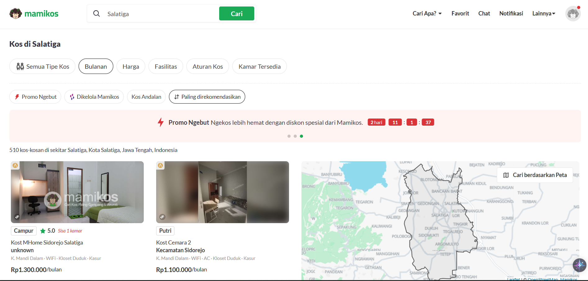

#  Machine Learning Project Report - Steven Graciano

## 📌 Project Overview
## Kos Reccomendation System🏘️

This project aims to design and compare two distinct recommendation models—Content-Based Filtering and Cluster-Based Filtering to assist users in identifying suitable boarding houses (kos) in Salatiga, Indonesia. The objective is to improve the accommodation selection process by providing personalized recommendations aligned with user preferences and previously liked properties. Rather than combining models into a hybrid system, each will be developed and evaluated separately to determine which offers higher accuracy, relevance, and efficiency.

## ❔ Business Understanding

The motivation for this project arises from the common difficulty users face when searching for rental accommodations that match their specific preferences. Traditional listing platforms often lack personalization features, requiring users to manually browse numerous irrelevant listings.

To address this, the project investigates two machine learning-based techniques:

- Content-Based Filtering (CBF) recommends properties that share similar features—such as location, facilities, and type—with those the user has previously shown interest in.

- Cluster-Based Filtering (CLF) utilizes unsupervised learning (e.g., K-Means clustering) to group properties with similar characteristics and recommends items from the same cluster as the user’s selected reference.

By developing both models separately, the project aims to evaluate which technique provides more relevant recommendations, better performance, and interpretability.

### ❌ Problem Statements

- How can a content-based filtering model be constructed to provide personalized boarding house recommendations based on explicit features?

- How effective is a cluster-based filtering model in delivering recommendations when items are grouped using shared characteristics?

- Between content-based and cluster-based filtering, which model yields more accurate and relevant suggestions for users in the Salatiga region?

### 🎯 Goals
- To build a content-based filtering model that recommends boarding houses by calculating the similarity between user-specified preferences and property features using appropriate similarity metrics.

- To construct a cluster-based filtering model that segments the property dataset and recommends items from the same cluster as a given reference.

- To evaluate both models using defined performance metrics such as Precision, Recall, and Silhouette Score, and determine which better reflects user preferences and usability.

### 🟢 Solution Statements
**Solution 1: Content-Based Filtering Model**

Develop a similarity-based recommendation system using cosine similarity to measure the likeness between properties based on their feature vectors.

Key features may include:
1. location
2. Type
3. Facility

**Solution 2: Cluster-Based Filtering Model**

Apply K-Means clustering to group properties into homogeneous clusters based on the same set of features.

When a user inputs a preferred boarding house, the system identifies its cluster and recommends other properties from within the same cluster, assuming semantic similarity.

Both models will be assessed independently through comparative analysis covering recommendation quality, computational performance, and system usability.

--- 

## 📅❔ Data Understanding

The Mamikos.csv dataset was collected via web scraping from website [Mamikos.com/Salatiga](https://mamikos.com/cari/salatiga-kota-salatiga-jawa-tengah-indonesia/all/bulanan/0-15000000/168?keyword=salatiga&suggestion_type=search&rent=2&sort=price,-&price=10000-20000000&singgahsini=0), using the Data Miner Chrome extension.
It contains data about rental properties (boarding houses/kos-kosan) in Salatiga, Indonesia.
- **Data include 518 rows and 5 column**

| # | Column | Non-Null Count | Dtype |
|:---|:---|:---|:---|
| 0 | nama_kos | 518 non-null | object |
| 1 | tipe | 518 non-null | object |
| 2 | alamat | 518 non-null | object |
| 3 | fasilitas | 507 non-null | object |
| 4 | harga | 518 non-null | object |

**🧾 Dataset Columns**

- nama_kos : Name of the boarding house available for rent
- tipe : boarding houses/kos-kosan Type -> Putra, Putri, Campur
- alamat: Sub-district where the boarding house is located
- fasilitas: Facilities or amenities provided (e.g., Wi-Fi, AC)
- harga: Rental price of the boarding house.

**EDA : Exploratory Data Analysis**

**ℹ️📅 Data Understanding Insights**

- **Inconsistent Values**  
  We found inconsistent values in the `alamat` column — some entries only mention the area name (e.g., "Sidorejo"), while others include the word "Kecamatan" (e.g., "Kecamatan Sidomukti").  
  - **Action**: Standardize all entries by removing the prefix **"Kecamatan"** so they merge under a unified value (e.g., `"Kecamatan Sidomukti"` → `"Sidomukti"`).

- **Unknown Values**  
  We found unknown or improperly formatted values in the `alamat` column, such as `"Kost MHome Sidorejo Salatiga"`.  
  - **Action**: These entries will be **renamed/cleaned** for consistency and quality.

- **Missing Values**  
  There are `11 missing values` in the `fasilitas` column.  
  - **Action**: Rows with missing values will be **dropped** to ensure data integrity.

- **Duplicate Entries**  
  We discovered `291 duplicate rows` in the dataset.  
  - **Action**: All duplicates will be **removed** to prevent data bias.

- **Incorrect Data Type**  
  The `harga` (price) column is currently of type **object (string)**.  
  - **Action**: It will be **converted to a numeric type** to enable proper calculations and modeling.

## Data Preparation
In this stage, we apply all the findings from the data understanding phase. The following actions are taken to clean and prepare the data:

* **Inconsistent Values**  
  * We found inconsistent values in the `alamat` column — some entries only mention the area name (e.g., "Sidorejo"), while others include the word "Kecamatan" (e.g., "Kecamatan Sidomukti").  
  * **Action**: Standardize all entries by removing the prefix **"Kecamatan"** so they merge under a unified value (e.g., `"Kecamatan Sidomukti"` → `"Sidomukti"`).

* **Rename Unknown Values**  
  * We Found unknown values in alamat of `Kost MHome Sidorejo Salatiga`
  * **Action**: These rows will be **Rename** to maintain data quality.

* **Missing Values**  
  * There are 11 missing values in the `fasilitas` column.  
  * **Action**: These rows will be dropped to maintain data quality.

* **Duplicate Entries**  
  * The dataset contains 212 duplicated rows.  
  * **Action**: These rows will be **dropped** to maintain data quality.

* **Incorrect Data Type**  
  * The `harga` (price) column is currently stored as an object (string).  
  * **Action**: This column will be converted into a numeric data type for better analysis and modeling.

---

**Text Preprocessing**

Further preprocessing will be applied to all text columns:

* **Text Cleaning**  
Standardizing text format by converting to lowercase and removing extra whitespace.

* **Tokenization**  
Splitting text into individual words (tokens) for easier manipulation and analysis.

* **Stopword Removal**  
Eliminating common words that carry little analytical value, such as “and”, “in”, “the”, etc.

---

**Feature Engineering**

* **Using a Cleaned DataFrame**

  In this step, we eliminate unnecessary columns and store the refined data into a new variable called `df_clean`. This allows us to focus only on the relevant features for our recommendation system.
  

* **Creating a Combined Feature Column for Recommendation System**

Next, we create a new column called `FITUR_LENGKAP` by combining the values from the `TIPE`, `ALAMAT`, and `FASILITAS` columns. This combined text will serve as the input feature for the content-based recommendation system using **TF-IDF** and **Cosine Similarity** methods.

## Modeling
Tahapan ini membahas mengenai model sisten rekomendasi yang Anda buat untuk menyelesaikan permasalahan. Sajikan top-N recommendation sebagai output.

**Rubrik/Kriteria Tambahan (Opsional)**: 
- Menyajikan dua solusi rekomendasi dengan algoritma yang berbeda.
- Menjelaskan kelebihan dan kekurangan dari solusi/pendekatan yang dipilih.

## Evaluation
Pada bagian ini Anda perlu menyebutkan metrik evaluasi yang digunakan. Kemudian, jelaskan hasil proyek berdasarkan metrik evaluasi tersebut.

Ingatlah, metrik evaluasi yang digunakan harus sesuai dengan konteks data, problem statement, dan solusi yang diinginkan.

**Rubrik/Kriteria Tambahan (Opsional)**: 
- Menjelaskan formula metrik dan bagaimana metrik tersebut bekerja.

**---Ini adalah bagian akhir laporan---**

_Catatan:_
- _Anda dapat menambahkan gambar, kode, atau tabel ke dalam laporan jika diperlukan. Temukan caranya pada contoh dokumen markdown di situs editor [Dillinger](https://dillinger.io/), [Github Guides: Mastering markdown](https://guides.github.com/features/mastering-markdown/), atau sumber lain di internet. Semangat!_
- Jika terdapat penjelasan yang harus menyertakan code snippet, tuliskan dengan sewajarnya. Tidak perlu menuliskan keseluruhan kode project, cukup bagian yang ingin dijelaskan saja.
