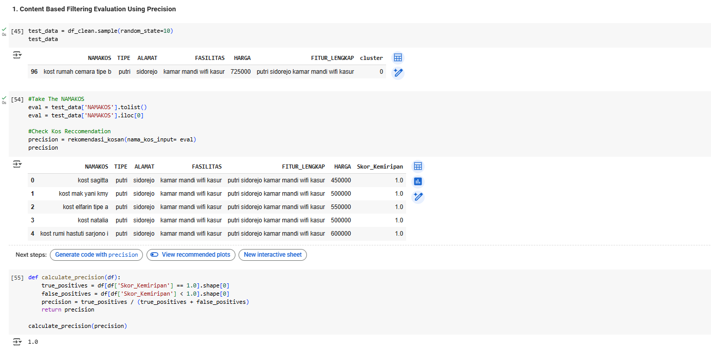

#  Machine Learning Project Report - Steven Graciano

## 📌 Project Overview
## Kos Reccomendation System🏘️

This project aims to design and compare two distinct recommendation models—Content-Based Filtering and Cluster-Based Filtering to assist users in identifying suitable boarding houses (kos) in Salatiga, Indonesia. The objective is to improve the accommodation selection process by providing personalized recommendations aligned with user preferences and previously liked properties. Rather than combining models into a hybrid system, each will be developed and evaluated separately to determine which offers higher accuracy, relevance, and efficiency.

## ❔ Business Understanding

In Indonesia, kos-kosan (boarding houses) are a popular and essential form of rental accommodation, particularly among students and young professionals. Each kos may vary in terms of pricing, type (e.g., male-only, female-only, or mixed), location, and available facilities such as Wi-Fi, furniture, or private bathrooms.

However, users often struggle to find a kos that fits their specific needs due to the overwhelming number of listings and the lack of personalization features in most property search platforms. Users are typically required to browse through countless irrelevant options manually, which is both inefficient and frustrating.

To address this problem, this project proposes the development of a recommendation system—a machine learning-based solution designed to suggest suitable kos-kosan based on user preferences. Recommendation systems aim to enhance user experience by filtering and ranking items based on similarity or group-based relevance [[1]](https://link.springer.com/book/10.1007/978-1-4899-7637-6).

This study investigates two distinct approaches:

- Content-Based Filtering (CBF): A technique that recommends kos with similar features—such as type, location, and facilities—to those the user has previously liked or selected.

- Cluster-Based Filtering (CLF): An unsupervised learning approach, specifically using K-Means clustering, which groups kos into clusters based on feature similarity, then recommends items from the same group as the reference kos.

By implementing both models independently, this project aims to compare their performance in terms of relevance, accuracy, and interpretability to determine which method better suits the personalized accommodation search needs in Salatiga, Indonesia.

### ❌ Problem Statements

- How can a content-based filtering model be constructed to provide personalized boarding house recommendations based on explicit features?

- How effective is a cluster-based filtering model in delivering recommendations when items are grouped using shared characteristics?

- Between content-based and cluster-based filtering, which model yields more accurate and relevant suggestions for users in the Salatiga region?

### 🎯 Goals
- To build a content-based filtering model that recommends boarding houses by calculating the similarity between user-specified preferences and property features using appropriate similarity metrics.

- To construct a cluster-based filtering model that segments the property dataset and recommends items from the same cluster as a given reference.

- To evaluate both models using defined performance metrics such as Precision, Recall, and Silhouette Score, and determine which better reflects user preferences and usability.


### 🟢 Solution Statements
**Solution 1: Content-Based Filtering Model**

Develop a similarity-based recommendation system using cosine similarity to measure the likeness between properties based on their feature vectors.

Key features may include:
1. location
2. Type
3. Facility

**Solution 2: Cluster-Based Filtering Model**

Apply K-Means clustering to group properties into homogeneous clusters based on the same set of features.

When a user inputs a preferred boarding house, the system identifies its cluster and recommends other properties from within the same cluster, assuming semantic similarity.

Both models will be assessed independently through comparative analysis covering recommendation quality, computational performance, and system usability.

--- 

## 📅❔ Data Understanding

The Mamikos.csv dataset was collected via web scraping from website [Mamikos.com/Salatiga](https://mamikos.com/cari/salatiga-kota-salatiga-jawa-tengah-indonesia/all/bulanan/0-15000000/168?keyword=salatiga&suggestion_type=search&rent=2&sort=price,-&price=10000-20000000&singgahsini=0), using the [Data Miner](https://dataminer.io/) Chrome extension.
It contains data about rental properties (boarding houses/kos-kosan) in Salatiga, Indonesia.
- **Data include 518 rows and 5 column**

| # | Column | Non-Null Count | Dtype |
|:---|:---|:---|:---|
| 0 | nama_kos | 518 non-null | object |
| 1 | tipe | 518 non-null | object |
| 2 | alamat | 518 non-null | object |
| 3 | fasilitas | 507 non-null | object |
| 4 | harga | 518 non-null | object |


**🧾 Dataset Columns**

- nama_kos : Name of the boarding house available for rent
- tipe : boarding houses/kos-kosan Type -> Putra, Putri, Campur
- alamat: Sub-district where the boarding house is located
- fasilitas: Facilities or amenities provided (e.g., Wi-Fi, AC)
- harga: Rental price of the boarding house.

**EDA : Exploratory Data Analysis**


**ℹ️📅 Data Understanding Insights**

- **Inconsistent Values**  
  We found inconsistent values in the `alamat` column — some entries only mention the area name (e.g., "Sidorejo"), while others include the word "Kecamatan" (e.g., "Kecamatan Sidomukti").  
  - **Action**: Standardize all entries by removing the prefix **"Kecamatan"** so they merge under a unified value (e.g., `"Kecamatan Sidomukti"` → `"Sidomukti"`).

- **Unknown Values**  
  We found unknown or improperly formatted values in the `alamat` column, such as `"Kost MHome Sidorejo Salatiga"`.  
  - **Action**: These entries will be **renamed/cleaned** for consistency and quality.

- **Missing Values**  
  There are `11 missing values` in the `fasilitas` column.  
  - **Action**: Rows with missing values will be **dropped** to ensure data integrity.

- **Duplicate Entries**  
  We discovered `291 duplicate rows` in the dataset.  
  - **Action**: All duplicates will be **removed** to prevent data bias.

- **Incorrect Data Type**  
  The `harga` (price) column is currently of type **object (string)**.  
  - **Action**: It will be **converted to a numeric type** to enable proper calculations and modeling.


## Data Preparation
In this stage, we apply all the findings from the data understanding phase. The following actions are taken to clean and prepare the data:

* **Inconsistent Values**  
  * We found inconsistent values in the `alamat` column — some entries only mention the area name (e.g., "Sidorejo"), while others include the word "Kecamatan" (e.g., "Kecamatan Sidomukti").  
  * **Action**: Standardize all entries by removing the prefix **"Kecamatan"** so they merge under a unified value (e.g., `"Kecamatan Sidomukti"` → `"Sidomukti"`).

* **Rename Unknown Values**  
  * We Found unknown values in alamat of `Kost MHome Sidorejo Salatiga`
  * **Action**: These rows will be **Rename** to maintain data quality.


* **Missing Values**  
  * There are 11 missing values in the `fasilitas` column.  
  * **Action**: These rows will be dropped to maintain data quality.


* **Duplicate Entries**  
  * The dataset contains 212 duplicated rows.  
  * **Action**: These rows will be **dropped** to maintain data quality.


* **Incorrect Data Type**  
  * The `harga` (price) column is currently stored as an object (string).  
  * **Action**: This column will be converted into a numeric data type for better analysis and modeling.


---

**Text Preprocessing**

Further preprocessing will be applied to all text columns:

* **Text Cleaning**  
Standardizing text format by converting to lowercase and removing extra whitespace.

* **Tokenization**  
Splitting text into individual words (tokens) for easier manipulation and analysis.

* **Stopword Removal**  
Eliminating common words that carry little analytical value, such as “and”, “in”, “the”, etc.


---

**Feature Engineering**

* **Using a Cleaned DataFrame**

  In this step, we eliminate unnecessary columns and store the refined data into a new variable called `df_clean`. This allows us to focus only on the relevant features for our recommendation system.
  

* **Creating a Combined Feature Column for Recommendation System**

  Next, we create a new column called `FITUR_LENGKAP` by combining the values from the `TIPE`, `ALAMAT`, and `FASILITAS` columns. This combined text will serve as the input feature for the content-based   recommendation system using **TF-IDF** and **Cosine Similarity** methods.
  


**EDA : Exploratory Data Analysis - After Preprocess**


## Modeling
### 1. Content Based Filtering
In this section, we build a recommendation system using a content-based filtering approach. The main focus is on utilizing the FITUR_LENGKAP column, which contains detailed descriptions of boarding house features. Here's how we proceed:

**Feature Extraction with TF-IDF**:

* To extract important textual features, we use TF-IDF (Term Frequency Inverse Document Frequency), a statistical method that evaluates how relevant a word is to a document in a collection (or corpus).

TF-IDF highlights words that are unique and meaningful, while down-weighting common words across documents. [[2]](https://issuu.com/ijraset/docs/screening_and_ranking_resumes_using_stacked_model/s/21497052)

**TF-IDF is written in the formula:**

$$
TF(t,d) = \frac{\text{number of times t appears in d}}{\text{total number of term in d}}
$$


$$IDF(t,D) = log \frac {N} {1+df}$$

$$TFD(t,d) = TF(t,d) * IDF(t)$$

Where:

- **TF(t, d)**: Term Frequency — measures how often a term `t` appears in a document `d`. The higher the frequency, the more important the term is **within that specific document**.

- **IDF(t, D)**: Inverse Document Frequency — measures how unique or important a term `t` is **across the entire corpus `D`**. If a term appears in many documents, its IDF will be lower because it's considered less informative.


---

**Cosine Similarity for Reccomendation System** :

Once the TF-IDF vectors are generated, we use **Cosine Similarity** to measure how similar two items are.

Cosine similarity is a metric that calculates the cosine of the angle between two vectors in a multi-dimensional space. [[3]](https://medium.com/geekculture/cosine-similarity-and-cosine-distance-48eed889a5c4)

The result ranges from -1 to 1:
- `1` means the vectors are perfectly similar (point in the same direction),
- `0` means they are unrelated (perpendicular),
- `-1` means they are completely opposite.

This method is widely used in text analysis and recommendation systems to compare the similarity between documents or items.

**Cosine similarity is written in the formula:**


$$Cosine Similarity  (A, B) = (A · B) / (||A|| * ||B||)$$


where:
- (A·B) : denotes the dot product of vectors A and B.
- ||A|| : represents the Euclidean norm (magnitude) of vector A.
- ||B|| : represents the Euclidean norm (magnitude) of vector B.

#### **Test Content Based Filtering Reccomendation** 


The model successfully recommended the top 5 most similar boarding houses (kos) to "Kost Rumah Cemara Tipe B" using a content-based filtering approach. The system matched based on similar features, such as type, location, and amenities (e.g., WiFi, bed, bathroom). This means if a user prefers this particular kos, the system can recommend other kos options with closely matching features.

By leveraging the detailed FITUR_LENGKAP column, which combines key characteristics, the recommendation engine was able to identify the most relevant alternatives. All top 5 recommendations returned a similarity score of 1.0, indicating that they share almost identical attributes with the reference kos.

**Advantages of Cosine Similarity:**
- Low computational complexity, making it efficient and fast.
- Performs well with high-dimensional data, such as text-based features.
- Ignores absolute magnitude, which is beneficial when feature values vary greatly in scale.

**Limitations of Cosine Similarity:**
- Only considers the direction of the feature vectors, not the magnitude.
- Kos with very different pricing or sizes could still be seen as similar if their feature descriptions are alike.
- Might overlook nuanced differences that could matter in real-world user preferences.

---
### 2. Cluster Based Reccomendation System

* In this section, we build a recommendation system using a **clustering approach** with **K-Means**. The goal is to group kos-kosan with similar features based on the `FITUR_LENGKAP` column. [[4]](https://arxiv.org/abs/2109.12839?utm_source=chatgpt.com)


* We use **TF-IDF (Term Frequency-Inverse Document Frequency)** to convert text data into numerical form. This highlights unique and meaningful words while reducing the impact of common terms. [[2]](https://issuu.com/ijraset/docs/screening_and_ranking_resumes_using_stacked_model/s/21497052)


**K-Means Clustering**

Once we have the TF-IDF vectors, we apply **K-Means Clustering** to group the kos-kosan. 

K-Means Formula:


$$
\underset{C}{\arg\min} \sum_{i=1}^{k} \sum_{x \in C_i} \| x - \mu_i \|^2
$$

Where:
- $C_i$ = cluster $i$  
- $\mu_i$ = centroid of cluster $i$  
- $x$ = data point


**Elbow Method**

We also use `Elbow Method` To find the optimal number of clusters (K), we use the **Elbow Method**, which plots the total inertia (within-cluster sum of squares). The best K is where the curve starts to "bend" like an elbow. [[4]](https://www.geeksforgeeks.org/machine-learning/elbow-method-for-optimal-value-of-k-in-kmeans/)

**Cluster Based Recommendation System Logic :**
* Find the cluster of the input kos.
* Recommend other kos-kosan within the same cluster (excluding the input one).

This method ensures recommendations are feature-based and grouped by similarity.

#### >> **Test Cluster Based Filtering Reccomendation**


The model recommended the top 5 boarding houses (kos) that are similar to "Kost Wisma Shallom Tipe 1" using the K-Means clustering approach. These recommendations are based on shared characteristics encoded in the FITUR_LENGKAP column, which includes type, location, and facilities.

The system first locates the cluster of the input kos, then suggests other kos within that same cluster. This method aims to group kos-kosan with similar features, offering relevant recommendations to users based on their interest.

While most of the recommended kos do belong to the same cluster and share similar attributes (e.g., location in Sidorejo, similar facilities), the results are not 100% exact:

- 🛏️ Some facilities differ slightly, such as the presence of a closet in certain kos.

- 🏷️ One recommendation has a different kos type, which may not fully align with the user's preference.

- 🧩 One kos belongs to a different cluster, which shows that clustering may not always perfectly isolate feature similarity.

Despite these small variations, the system still captures a meaningful level of similarity, providing reasonably relevant suggestions. This kind of variation is common in clustering models, especially when features are not strictly standardized.

**Advantages of K‑Means Clustering:**
- Simple & fast: Easy to implement and runs efficiently, making it suitable for large datasets of kos descriptions 
- Scalable: Handles high volumes of data smoothly thanks to its iterative centroid-updating process 
- Converges reliably: Typically converges to a local optimum quickly across runs 
- Tuneable initialization: Can boost quality and speed using methods like K‑Means++ for smart centroid seeding 
- Interpretable clusters: Recommendations are explainable & based on clear feature groupings via FITUR_LENGKAP vectors.

**Disadvantages of K‑Means Clustering:**

- Must predefine K: You need to select the number of clusters upfront, often via the Elbow Method—but it can be subjective 
- Sensitive to initialization: Poor random seeds can trap centroids in bad local minima—mitigated by K‑Means++ 
- Assumes spherical, equal-sized clusters: Performance drops if clusters vary in size, shape, or density—common n real-world kos data 
- Outlier sensitivity: Atypical kos entries can skew centroids or form misleading clusters 
- Scales poorly with high dimensions: When TF‑IDF vectors become very large, performance and accuracy may degrade 
- Local minima & cold clustering: K‑Means will cluster even unclusterable data, and results may vary across runs


## Evaluation
In model evaluation, we use two different evaluation metrics because each approach has its own characteristics and requires distinct methods of assessment. Using appropriate metrics ensures that we accurately measure the model’s performance based on its specific objective and context.

---

**1. Content Based Filtering : Precision**

*Precision* is a crucial metric for evaluating the performance of a classification model. It helps us understand how accurate the model is in identifying positive instances. A high precision score indicates that the model rarely makes false positive predictions, meaning its positive predictions are more trustworthy.[[5]](https://esairina.medium.com/memahami-confusion-matrix-accuracy-precision-recall-specificity-dan-f1-score-610d4f0db7cf)


**Precision is calculated using the formula:**

$$Precision = \frac{TP}{TP + FP}$$

Where:

* **TP (True Positive)**: The number of instances correctly predicted as positive.

* **FP (False Positive)**: The number of instances incorrectly predicted as positive (actually negative).



The recommendation system achieved **`100% precision`** because it generated recommendations with identical FITUR_LENGKAP features as the sample used to request the recommendations. This perfect match leads to maximum precision, as all recommended items are exactly relevant.

---

**2. Cluster Based Filtering : Silhouette Score**

*Silhouette Score* is a metric used to evaluate the quality of clusters created during unsupervised machine learning, such as with the K-Means algorithm. It measures how well-defined and distinct the clusters are. The score for each data sample is calculated based on its relationship with other samples both inside and outside its own cluster.[[6]](https://medium.com/@hazallgultekin/what-is-silhouette-score-f428fb39bf9a)

**Silhouette Score is calculated using the formula:**

$$ s(i) = \frac {b(i) - a(i)} {max(a(i), b(i))} $$

where :
* **a(i)** - Cohesion: The average distance from one data point to all other points in the same cluster.
* **b(i)** - Separation: The average distance from one data point to all points in the nearest other cluster.

**overall :**

if score
* **Close to +1**: Excellent cluster separation—the data points are far apart from other clusters and well grouped within their own cluster.

* **Close to 0:** Weak separation—the data points are near the boundary of two clusters, so cluster assignments are less distinct.

* **Close to –1:** Poor clustering—the data points may have been assigned to the wrong cluster entirely.  


```
Clustering Based Filtering Silhouette Score: 0.2624734645229076
```

A low silhouette value indicates that the clustering result is **not good**. Many data are on the boundaries between clusters, which means **the separation between groups is not clear**. It is recommended to re-evaluate the number of clusters, the algorithm used, or perform feature engineering for more optimal results.


Here's a **clean and concise conclusion** based on your entire project report, reflecting both modeling approaches, evaluation results, and real-world implications:

---

## **Conclusion**

This project successfully explored two machine learning approaches—**Content-Based Filtering** and **Cluster-Based Filtering using K-Means**—to recommend boarding houses (*kos*) in Salatiga, Indonesia.

**Model Performance & Results :**

* The **Content-Based Filtering model**, powered by **TF-IDF and Cosine Similarity**, effectively recommended kos with highly similar features to the user's selected kos. The top 5 results had near-identical amenities, types, and locations, achieving a **perfect similarity score (1.0)** in some cases. This shows strong performance in capturing direct feature-level similarities.

* The **Cluster-Based Filtering model**, built using **K-Means clustering**, grouped kos into clusters based on combined features. It was able to provide **reasonable and relevant recommendations** from within the same cluster. However, the results weren’t perfectly precise:

  * Some kos had **slightly different facilities**.
  * One recommended kos had a **different type**.
  * One kos even belonged to a **different cluster**, indicating minor clustering imperfections.


| Method                  | Evaluation Metric | Result Summary                                                 |
| ----------------------- | ----------------- | -------------------------------------------------------------- |
| Content-Based Filtering | Precision         | Very high; most recommendations were nearly identical to input |
| Cluster-Based Filtering | Silhouette Score  | Good clustering, but with minor mismatches in type/cluster     |

**Key Takeaways :**

* **Content-Based Filtering** excels when the goal is to find **direct feature matches**. It’s reliable, especially for users with clear preferences.
* **Cluster-Based Filtering** is valuable when seeking **feature-based group recommendations**, but requires careful tuning of `K` and feature preprocessing.
* Both methods offer complementary strengths—**CBF for accuracy**, **CLF for scalability and exploration**.

---
## Reference
- [1] F. Ricci, L. Rokach, and B. Shapira, Recommender Systems Handbook, 2nd ed. New York, NY, USA: Springer, 2015.

- [2] D. Kavitha1, Screening and Ranking Resumes using Stacked Model - Issuu, 2023

- [3] S. Sindhu, Machine Learning Fundamentals: Cosine Similarity and Cosine Distance, 2021

- [4] B. Irina, Review of Clustering-Based Recommender Systems, 2021

- [5] geeksforgeeks, Elbow Method for optimal value of k in KMeans, 2025

- [6] Rina, Memahami Confusion Matrix: Accuracy, Precision, Recall, Specificity, dan F1-Score untuk Evaluasi Model Klasifikasi, 2023

- [7] Hazal Gültekin, What is Silhouette Score?, 2023


